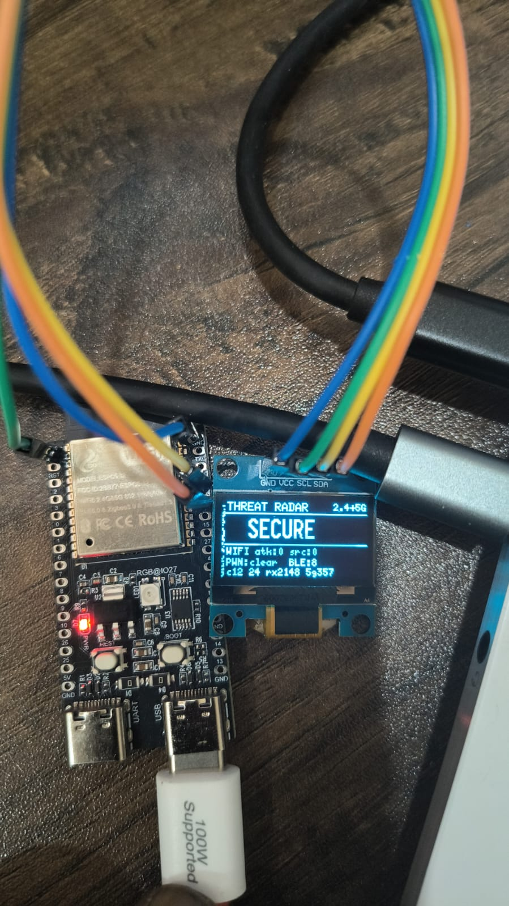
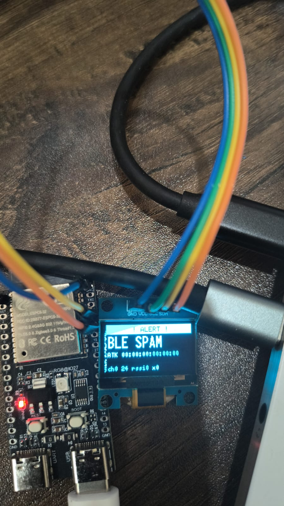
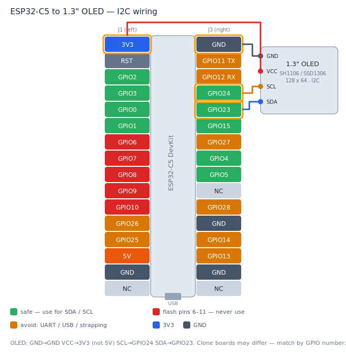

# 🛡️ Wireless Threat Radar — ESP32-C5 (dual-band 2.4 + 5 GHz)

A pocket **defensive wireless monitor** for the **ESP32-C5 + a 1.3″ I2C OLED**. It passively watches the air on **both the 2.4 GHz and 5 GHz bands** and flags nearby wireless attacks on its screen in real time — **detection only, it never attacks.**

| 🟢 Live radar — SECURE | 🔴 Threat detected — ALERT |
|:---:|:---:|
|  |  |

*ESP32-C5 + 1.3″ I2C OLED prototype — live SECURE status (left) and a BLE-spam ALERT (right).*

> 📡 **Dual-band — this is the upgrade.** Most ESP32 deauth detectors are 2.4 GHz-only (the chip has no 5 GHz radio). The ESP32-C5 has a real dual-band Wi-Fi 6 radio, so this build also sees **5 GHz deauth/attacks and 5 GHz networks**. A live `5g` counter on screen (and in the serial log) proves management frames are actually arriving on 5 GHz channels.

> Built to learn how the attacks work by building the thing that catches them. Offense → defense.


---

## What it detects

| Threat | How | Screen |
|---|---|---|
| **Wi-Fi deauth / disassoc attack** | 802.11 promiscuous sniff on 2.4 **and** 5 GHz; `>10` deauth/disassoc frames per second from one source | 🔴 `WIFI DEAUTH` + attacker & target MAC, channel, band, RSSI |
| **Pwnagotchi nearby** | Beacon with source MAC `de:ad:be:ef:de:ad` (the pwngrid signature) | ⚠️ `PWNAGOTCHI` + RSSI |
| **BLE advertisement flood / spam** | Passive BLE scan; advertisement-rate spike + known spam company-IDs (Apple/MS/Google) | 🔴 `BLE SPAM` |
| **Zigbee / 802.15.4** | _deferred_ — needs Wi-Fi off (single-radio coexistence), so it's a future mode | — |

The OLED shows a big **SECURE / THREAT** status, compact per-protocol stats, and a footer with the current channel/band plus live `rx` and `5g` counters so you can see the sniffer is alive on both bands.

---

## Hardware

- **ESP32-C5 dev board** — dual-band Wi-Fi 6 (2.4 + 5 GHz) + BLE 5 + 802.15.4, 8 MB flash. (Tested on an "ESP32-C5 DevKit" class board.)
- **1.3″ I2C OLED** — SH1106 **or** SSD1306, 128×64, mono, 4-pin (GND / VCC / SCL / SDA).
- Nothing else. No external radios, no RGB, no buttons.

### Wiring



> You don't need the exact pins below — the firmware **auto-finds** the OLED on any safe GPIO pair at boot. These are just the recommended, convenient ones (GPIO23/24 are adjacent on the right header).

| OLED pin | ESP32-C5 pin | Notes |
|---|---|---|
| **GND** | any **GND** | — |
| **VCC** | **3V3** | ⚠️ **not 5V** |
| **SCL** | **GPIO24** | safe general GPIO |
| **SDA** | **GPIO23** | safe general GPIO, adjacent to GPIO24 |

The **I2C auto-finder** scans a set of *safe* GPIO pairs at boot and configures the display on whichever pair it finds — it handles swapped SDA/SCL and different board layouts automatically. If no OLED is found it runs **headless**: the radar and the serial logs still work.

> ⚠️ **Do not use GPIO6–10** — on the ESP32-C5 these are the flash / SDIO (FSPI) pins; driving them hangs the chip. Also avoid strapping pins (7, 25–28), UART0 (11/12), and USB (13/14). Safe pins for the OLED: **0–5 and 15–24** (the auto-finder probes these; GPIO4/5 double as LP-UART but work here since LP-UART is unused).

---

## Build & flash

**Toolchain:** [arduino-cli](https://arduino.github.io/arduino-cli/) (or Arduino IDE) with the **esp32 core ≥ 3.3** (ESP-IDF 5.5 — required for ESP32-C5 dual-band support) and the **U8g2** library.

```bash
arduino-cli core install esp32:esp32
arduino-cli lib install "U8g2"

arduino-cli compile --fqbn esp32:esp32:esp32c5:FlashSize=8M,PartitionScheme=huge_app --output-dir build .
```

> `FlashSize=8M` matches the board's 8 MB flash; `huge_app` is needed because Bluedroid BLE + Wi-Fi + U8g2 together overflow the default partition.

**Flash** the merged image at `0x0`.

**Windows** (replace `COM4` with your port — see the field notes about which port):
```bat
python -m esptool --chip esp32c5 -p COM4 -b 460800 write_flash 0x0 build/threat_radar_c5.ino.merged.bin
```

**Linux / macOS:**
```bash
esptool --chip esp32c5 -p /dev/ttyACM0 -b 460800 write_flash 0x0 build/threat_radar_c5.ino.merged.bin
# (if 'esptool' isn't found: python3 -m esptool ... ; install with: pip install esptool ; needs esptool >= 4.8 for C5)
```

Then open a serial monitor at **115200** to watch `[boot]` breadcrumbs and a `[run]` heartbeat every 3 s.

---

## The 5 GHz unlock (the one line that matters)

On the ESP32-C5, `esp_wifi_set_channel()` **rejects 5 GHz channels with `ESP_ERR_NOT_SUPPORTED`** unless you first put the radio into dual-band mode:

```c
esp_wifi_set_band_mode(WIFI_BAND_MODE_AUTO);   // after WiFi.mode(STA) + disconnect(false), before set_channel()
```

After that, `esp_wifi_set_channel(36 / 149 / …, WIFI_SECOND_CHAN_NONE)` tunes 5 GHz directly — no separate band switch per hop. The radar hops **2.4 GHz ch 1–13 + 5 GHz ch 36/40/44/48/149/153/157/161/165**. The presence beacon (an open SSID you can edit) is transmitted on **2.4 GHz only** — passive listening still covers 5 GHz, but transmitting on 5 GHz raises DFS/regulatory concerns, so it's left out.

---

## How it works (and its honest limits)

The ESP32-C5 has **one** radio shared by Wi-Fi and BLE, so everything is **time-sliced**:

- **Phase A (~19 s):** Wi-Fi promiscuous mode, channel-hopping across the full 2.4 + 5 GHz set. A minimal `IRAM_ATTR` sniffer callback pushes deauth events into a lock-free ring buffer; aggregation + thresholds run in the main loop.
- **Phase B (~2 s):** a bounded passive BLE scan (bundled Bluedroid), results cleared every cycle to avoid heap leaks.

Because it's one radio, sampling is **probabilistic** — it can miss frames on a channel it isn't currently parked on. With both bands in the hop set there are more channels to cover, so **run a test attack continuously for ~20–30 s** to be sure it lands in a sweep. This is physics, not a bug.

---

## ESP32-C5 field notes (the gotchas that cost us hours)

- **Two USB ports, two jobs.** The **UART-bridge port** (reset reason `rst:0x1 POWERON`) is where you flash **and** where the app's serial logs appear. The **native USB-Serial-JTAG port** (`rst:0x15 USB_UART_HPSYS`) only shows ROM/bootloader output — **never the app logs**. Flash and monitor on the UART-bridge port.
- **`E (..) MSPI Timing: Failed to allocate dummy cacheline for PSRAM memory barrier!` is benign and expected.** It's a cosmetic warning from the ESP32-C5 ROM at boot ([arduino-esp32 #12587](https://github.com/espressif/arduino-esp32/issues/12587)). The firmware continues normally — the `[boot]` and `[run]` log lines appear right below it. Do **not** reboot or reflash because of it.
- **Match flash size.** The board is 8 MB; build with `FlashSize=8M` (the default 4 MB mismatches the chip).
- **Pin hazards.** GPIO6–10 are flash/SDIO — using them hangs the chip (GPIO11/12 are UART0, 13/14 are USB). See the wiring note above.

---

## ⚖️ Legal & ethical use

This is a **passive, detection-only** tool for **education and defensive security**. It does **not** perform deauth, jamming, or any attack. Use it only on **networks and devices you own or are explicitly authorized to monitor**. You are responsible for complying with the laws in your jurisdiction. The authors assume no liability for misuse.

A pwnagotchi MAC is spoofable — detection is a hint, not proof.

---

## Authors

Built by **Chetan Saini** ([@cyberac1d](https://instagram.com/cyberac1d)) with **Ella**, his AI pair-partner. 🤝

Detection signatures & techniques reference the [ESP32 Marauder](https://github.com/justcallmekoko/ESP32Marauder) project and the pwnagotchi/pwngrid community. This is the dual-band sibling of the 2.4 GHz-only ESP32-C6 build.

## License

[MIT](LICENSE) © 2026 Chetan Saini
